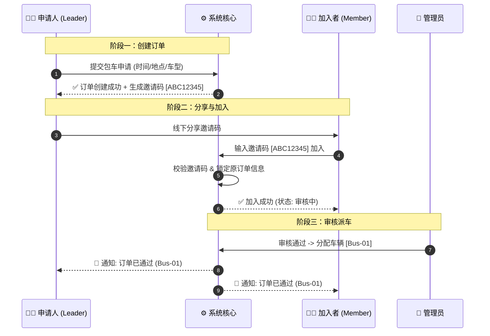
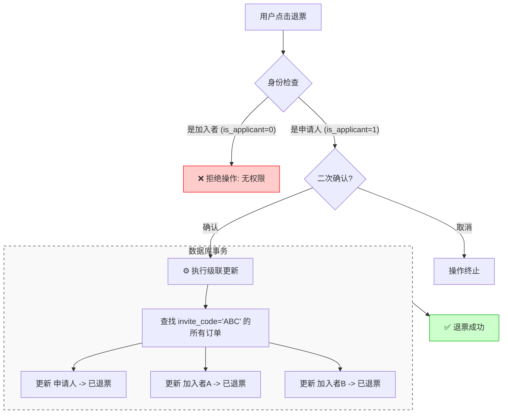
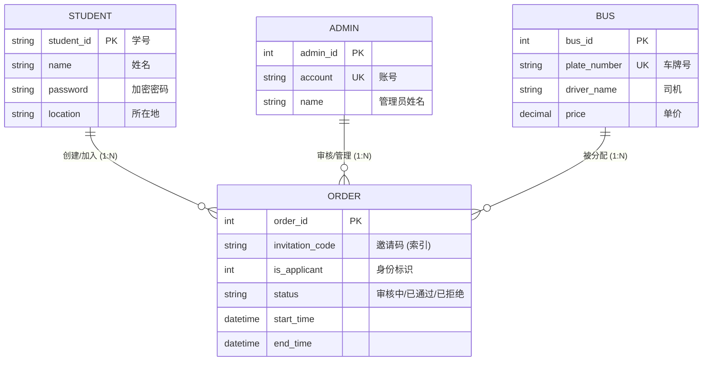
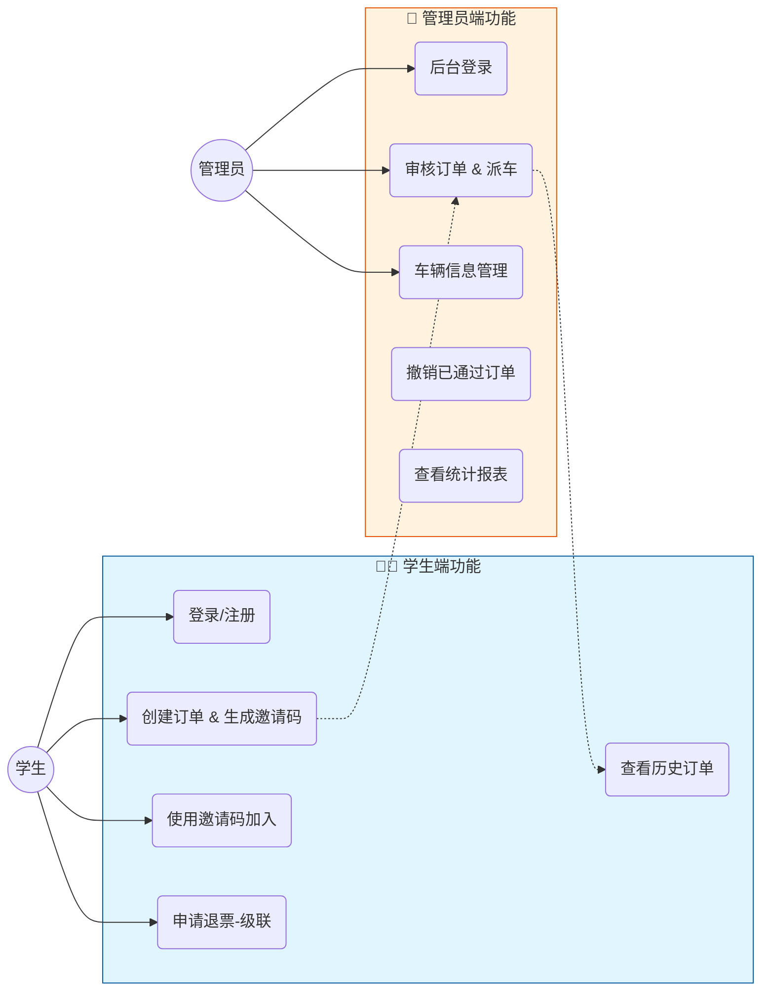
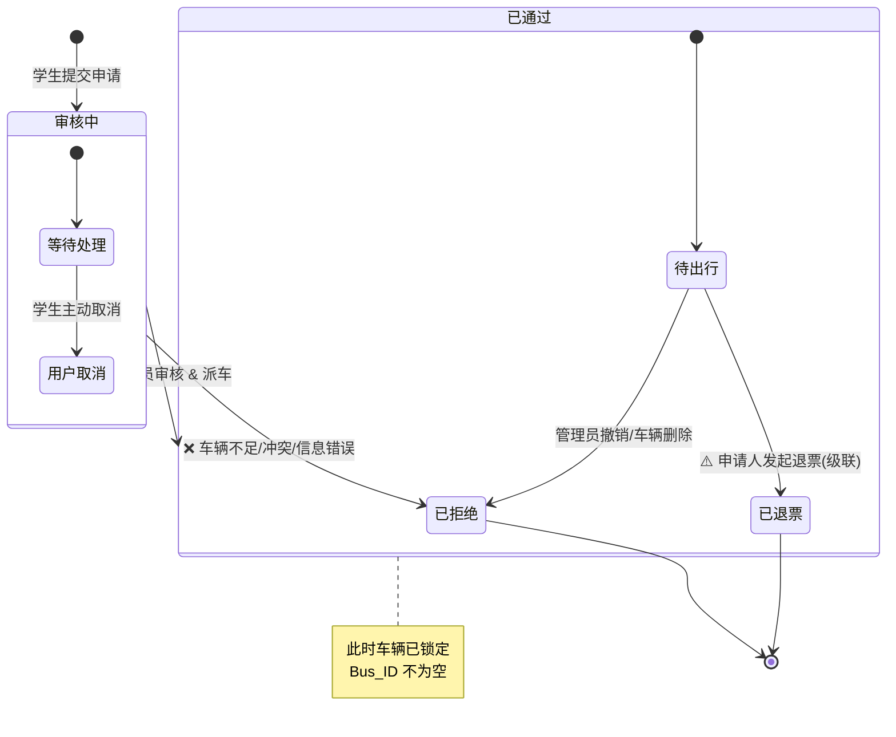
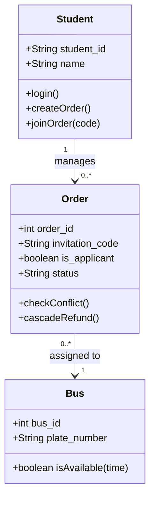
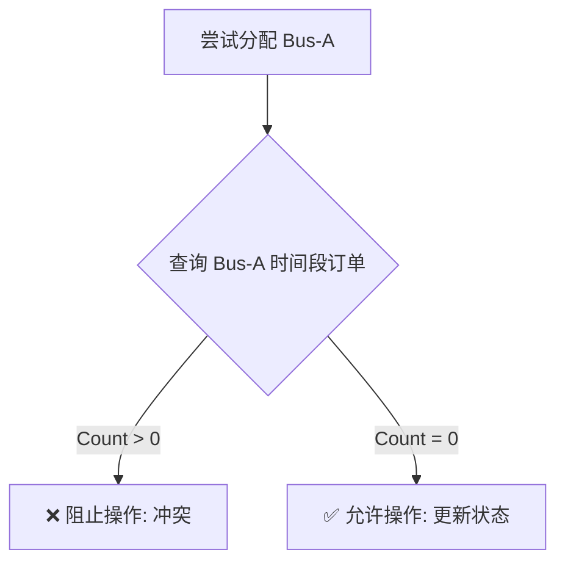

# 🚌 School Bus 系统开发文档

> **文档版本**: v1.1 (UML Enhanced) | **最后更新**: 2025-12-17
> **适用对象**: 开发团队、系统架构师、数据库管理员

**学生汽车包车预定系统** 是一个校园场景下的包车管理平台，支持学生在线申请包车，管理员审核和派车，实现包车业务的规范化、信息化管理。

---

## 📋 目录

1. [系统概述](#-系统概述)
2. [核心业务流程](#-核心业务流程)
3. [系统 UML 架构图 (新)](#-系统-uml-架构图)
4. [数据库设计](#-数据库设计)
5. [常见问题 & 排查](#-常见问题--排查)

---

## 🌟 系统概述

### 核心特性
| 模块 | 特性 | 说明 |
| :--- | :--- | :--- |
| **用户** | 🤝 **拼车机制** | 独创**邀请码**系统，支持多人通过 8 位码加入同一订单 |
| **后台** | ⚡ **快速审核** | 管理员实时处理，支持一键派车 |
| **逻辑** | 🔄 **级联退票** | 申请人退票时，自动级联同步至同组所有成员，防止死锁 |
| **安全** | 🛡️ **冲突检测** | 数据库级锁机制 + 应用层逻辑，智能防止车辆时间冲突 |

---

## 🔄 核心业务流程

### 1. 多人拼车与邀请码逻辑


### 2. 级联退票逻辑 (Refund Cascade)
> ⚠️ **警告**：退票是破坏性操作，一旦执行，该邀请码关联的所有订单将全部失效。



---

## 📐 系统 UML 架构图

### 1. 实体关系图 (ER Diagram)
展示系统核心实体及其交互关系。



### 2. 系统用例图 (System Use Cases)
区分学生端与管理员端的职责边界。



### 3. 状态流转图 (Order State Machine)
订单生命周期的完整流转逻辑。



### 4. 类图 (Class Diagram)
核心业务类的属性与方法设计。



---

## 💾 数据库设计

### 核心表：`t_order`
```sql
CREATE TABLE `t_order` (
  `order_id` int(11) NOT NULL AUTO_INCREMENT,
  `student_id` varchar(20) NOT NULL COMMENT '申请人学号',
  `bus_id` int(11) DEFAULT NULL COMMENT '分配车辆ID',
  `status` varchar(20) DEFAULT '审核中' COMMENT '状态',
  `invitation_code` varchar(20) DEFAULT NULL COMMENT '核心：邀请码',
  `is_applicant` tinyint(4) NOT NULL DEFAULT '1' COMMENT '1=发起人, 0=加入者',
  `start_time` datetime DEFAULT NULL,
  `end_time` datetime DEFAULT NULL,
  PRIMARY KEY (`order_id`),
  /* 复合索引优化冲突查询 */
  INDEX `idx_bus_time` (`bus_id`, `start_time`, `end_time`),
  /* 索引优化级联退票 */
  INDEX `idx_invite_code` (`invitation_code`)
) ENGINE=InnoDB DEFAULT CHARSET=utf8mb4;
```

---

## ❓ 常见问题 & 排查

<details>
<summary><strong>🔴 故障：管理员派车提示“时间冲突”</strong></summary>

**现象**：点击“通过”时，系统报错“该车辆在此时段已被占用”。

**逻辑图解**：

**解决方案**：请选择另一辆车，或先撤销原来的冲突订单。
</details>

<details>
<summary><strong>❓ 问题：为什么加入者不能退票？</strong></summary>

**设计初衷**：
为了防止拼车成员随意退出导致剩下的成员分摊费用变化（或车辆空置），系统规定**“同进同退”**。
* 只有发起人（队长）有权决定是否取消整个行程。
* 若加入者确实需要单独退出，需联系管理员在后台手动操作。
</details>

---