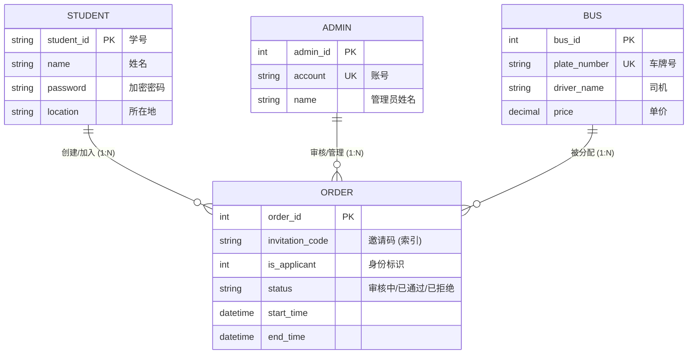
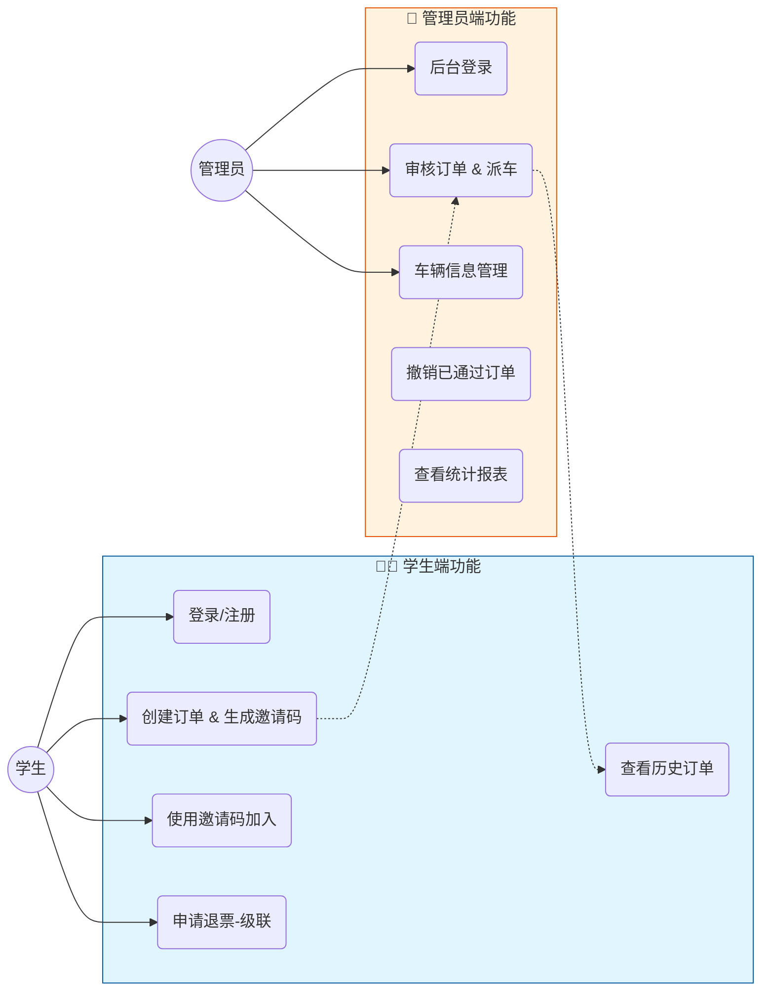
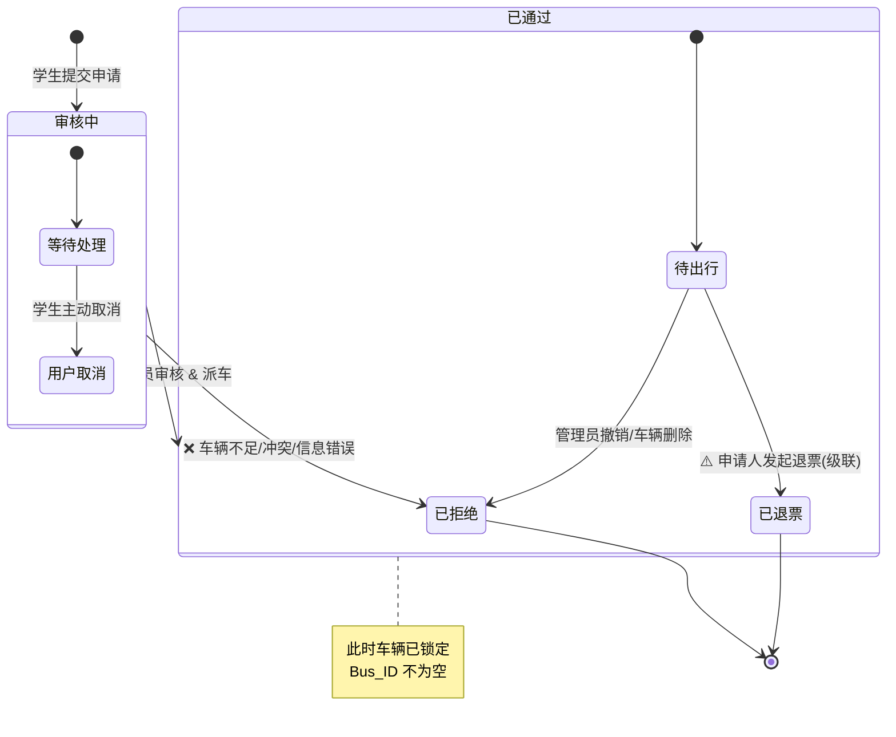
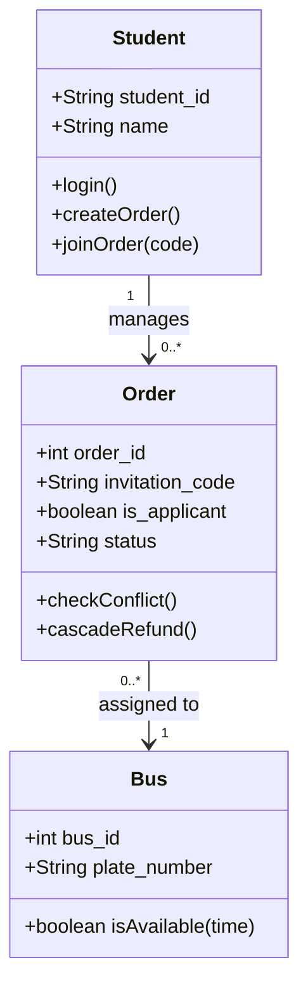

# School Bus 系统帮助文档

这是学生汽车包车预定系统的完整帮助文档，涵盖系统功能、功能说明和使用指南。

------

##  目录

1. [系统概述](#系统概述)
2. [用户类型](#用户类型)
3. [学生端功能](#学生端功能)
4. [管理员端功能](#管理员端功能)
5. [核心业务流程](#核心业务流程)
6. [数据库设计](#数据库设计)
7. [API接口](#api接口)
8. [常见问题](#常见问题)
9. [故障排查](#故障排查)

------

## 系统概述

**学生汽车包车预定系统** 是一个校园场景下的包车管理平台，支持学生在线申请包车，管理员审核和派车，实现包车业务的规范化、信息化管理。

**核心流程：**
```
学生申请 → 管理员审核 → 车辆分配 → 订单确认 → 管理跟踪
```

**系统特点：**
-  在线申请和管理：学生可随时随地提交包车申请
-  实时审核和派车：管理员快速审核和分配车辆
-  邀请码加入：支持学生通过邀请码加入他人订单
-  申请退票：支持申请人申请退票，级联更新同邀请码订单
-  时间冲突检查：防止同一车辆被重复分配
- 完整的订单追踪：从申请到完成的全程记录
- **极致的交互体验**：全站集成加载动画与骨架屏，操作流畅无卡顿

------

## 🌟 系统概述

### 核心特性
| 模块 | 特性 | 说明 |
| :--- | :--- | :--- |
| **用户** | 🤝 **拼车机制** | 独创**邀请码**系统，支持多人通过 8 位码加入同一订单 |
| **后台** | ⚡ **快速审核** | 管理员实时处理，支持一键派车 |
| **逻辑** | 🔄 **级联退票** | 申请人退票时，自动级联同步至同组所有成员，防止死锁 |
| **安全** | 🛡️ **冲突检测** | 数据库级锁机制 + 应用层逻辑，智能防止车辆时间冲突 |

---

## 学生端功能

### 1. 注册和登录

**注册流程：**
1. 点击"注册"按钮
2. 填写学号、姓名、密码、所在地
3. 点击"确认注册"
4. 系统验证学号是否已存在
5. 注册成功，自动跳转到登录页面

**登录流程：**
1. 输入学号和密码
2. 点击"登录"按钮
3. 验证成功后进入学生主界面

---

### 2. 创建包车申请

**申请流程：**
1. 进入"申请包车"页面
2. 填写以下信息：
   - **目的地**：包车的目标地点（必填）
   - **使用时间**：出发时间和返回时间（必填）
   - **需求车型**：选择需要的车型（必填）
3. 点击"提交申请"
4. 系统自动创建订单，状态为"审核中"
5. **系统自动生成邀请码**（8位随机字符）
6. 只有申请人可以看到邀请码

**邀请码用途：**
- 申请人可以分享给其他学生
- 其他学生可以通过邀请码加入此订单
- 加入者将与申请人共享同一辆车

---

### 3. 我的订单

**订单状态说明：**

| 状态 | 说明 | 操作 |
|------|------|------|
| 审核中 | 订单待管理员审核 | 可取消订单 |
| 已通过 | 审核通过，车辆已分配 | 可查看车辆信息、申请退票 |
| 已拒绝 | 审核不通过或被取消 | 可查看拒绝原因 |
| 已退票 | 申请人申请了退票 | 无法操作 |

**订单详情显示：**
- 审核中：显示"等待审核"
- 已通过：显示车牌号、司机姓名、司机电话、订单费用
- 已拒绝：显示醒目的拒绝原因（如"车辆不足"、"时间冲突"等）
- 已退票：显示"✓ 已退票"标签

---

### 4. 通过邀请码加入订单

**加入流程：**
1. 获取其他学生分享的邀请码
2. 进入"加入包车"页面
3. 输入邀请码（8位字符）
4. 点击"加入"
5. 系统验证邀请码有效性
6. 加入成功，该订单被复制一份到你的订单列表
7. 新订单状态为"审核中"，等待管理员审核

**重要说明：**
- 加入者与申请人是**同一订单**，使用同一车辆
- 加入者**看不到邀请码**
- 加入者**不能申请退票**（只有申请人可以）
- 加入者**无法查看其他加入者**

---

### 5. 申请退票

**退票条件：**
-  必须是订单的申请人（is_applicant=1）
-  订单状态必须是"已通过"
-  订单必须有有效的邀请码

**退票流程：**
1. 在"已通过"的订单上点击"申请退票"按钮
2. 弹出确认对话框：**"此操作将退掉该邀请码下所有学生的订单，确认继续吗？"**
3. 点击"确认"
4. 系统处理退票：
   - 同邀请码的**所有订单**都变为"已退票"
   - 包括申请人和所有加入者
5. 退票成功，所有学生看到订单变为"✓ 已退票"

**重要说明：**
- 退票是**级联的**：同邀请码的所有学生都受影响
- 退票后**无法取消**（需要管理员手动恢复）
- 退票意味着**整个拼车计划被取消**

---

### 6. 个人信息管理

**修改信息：**
1. 点击"个人信息"
2. 修改以下内容：
   - 姓名
   - 所在地
   - 密码
3. 点击"保存"

---

## 管理员端功能

### 1. 管理员登录

**登录流程：**
1. 输入管理员账号和密码
2. 点击"登录"
3. 验证成功进入管理后台

**默认管理员：**
- 账号：`admin`
- 密码：`123456`

---

### 2. 订单审核

**待审核订单列表：**
- 显示所有状态为"审核中"的订单
- 按照申请时间从新到旧排序
- 每条订单显示：学号、目的地、时间、车型

**审核操作 A：通过申请**

步骤：
1. 找到要通过的订单
2. 点击"通过"按钮
3. 在弹窗中选择可用的车辆
4. 输入订单费用
5. 点击"确认通过"
6. 订单状态变为"已通过"，车辆被分配

**注意：**
- 只能选择**当前时间段内没有冲突**的车辆
- 系统自动检查时间冲突
- 若所有车辆都有冲突，请选择拒绝或等待其他订单完成

**审核操作 B：拒绝申请**

步骤：
1. 找到要拒绝的订单
2. 点击"拒绝"按钮
3. **必须填写拒绝理由**（如：车辆不足、时间冲突、目的地不可达等）
4. 点击"确认拒绝"
5. 订单状态变为"已拒绝"，学生可看到拒绝原因

---

### 3. 订单撤销

**撤销条件：**
- 订单状态必须是"已通过"

**撤销流程：**
1. 找到已通过的订单
2. 点击"撤销"按钮
3. 填写撤销理由
4. 点击"确认撤销"
5. 订单状态变为"已拒绝"，分配的车辆被释放

**撤销原因示例：**
- 用户主动要求取消
- 特殊情况无法安排
- 其他业务调整

---

### 4. 车辆管理

**车辆信息字段：**

| 字段 | 说明 |
|------|------|
| 车牌号 | 车辆牌照（唯一） |
| 车型 | 如"45座大巴"、"19座中巴"等 |
| 司机姓名 | 驾驶员名字 |
| 单价 | 包车价格（元/次） |
| 司机号码 | 联系电话 |

**添加车辆：**
1. 点击"添加车辆"
2. 填写上述信息
3. 点击"确认添加"
4. 系统检查车牌号是否重复
5. 添加成功

**编辑车辆：**
1. 在车辆列表中点击"编辑"
2. 修改需要的信息
3. 点击"保存"

**删除车辆：**
1. 在车辆列表中点击"删除"
2. 弹出确认对话框
3. 点击"确认删除"
4. **系统自动处理：** 所有该车辆的订单状态变为"已拒绝"，拒绝原因为"车辆已删除"

**重要说明：**
- 车牌号唯一，不能重复添加
- 删除车辆不会删除历史订单，只是标记为"已拒绝"
- 若订单未删除，车辆仍可被恢复（通过编辑）

---

## 核心业务流程

### 流程 1：基础订单流程

```
┌─────────────────────────────────────────────────┐
│            基础订单流程（正常路径）               │
└─────────────────────────────────────────────────┘

1. 学生创建申请
   ├─ 订单创建
   ├─ 状态：审核中
   └─ 生成邀请码（仅申请人可见）

2. 管理员审核
   ├─ 选择通过
   ├─ 分配车辆
   ├─ 输入费用
   └─ 订单状态变为"已通过"

3. 订单完成
   ├─ 学生看到车辆和司机信息
   ├─ 可以申请退票（仅申请人）
   └─ 可以查看订单详情
```

---

## 📐 系统 UML 架构图

### 1. 实体关系图 (ER Diagram)
展示系统核心实体及其交互关系。



### 2. 系统用例图 (System Use Cases)
区分学生端与管理员端的职责边界。



### 3. 状态流转图 (Order State Machine)
订单生命周期的完整流转逻辑。



### 4. 类图 (Class Diagram)
核心业务类的属性与方法设计。



---

## 💾 数据库设计

### 核心表：`t_order`
```sql
CREATE TABLE `t_order` (
  `order_id` int(11) NOT NULL AUTO_INCREMENT,
  `student_id` varchar(20) NOT NULL COMMENT '申请人学号',
  `bus_id` int(11) DEFAULT NULL COMMENT '分配车辆ID',
  `status` varchar(20) DEFAULT '审核中' COMMENT '状态',
  `invitation_code` varchar(20) DEFAULT NULL COMMENT '核心：邀请码',
  `is_applicant` tinyint(4) NOT NULL DEFAULT '1' COMMENT '1=发起人, 0=加入者',
  `start_time` datetime DEFAULT NULL,
  `end_time` datetime DEFAULT NULL,
  PRIMARY KEY (`order_id`),
  /* 复合索引优化冲突查询 */
  INDEX `idx_bus_time` (`bus_id`, `start_time`, `end_time`),
  /* 索引优化级联退票 */
  INDEX `idx_invite_code` (`invitation_code`)
) ENGINE=InnoDB DEFAULT CHARSET=utf8mb4;
```

---

## ❓ 常见问题 & 排查

<details>
<summary><strong>🔴 故障：管理员派车提示“时间冲突”</strong></summary>

**现象**：点击“通过”时，系统报错“该车辆在此时段已被占用”。

**例如：** `ABC12345`

---

### Q2: 什么是"申请人"和"加入者"？

**A:** 
- **申请人**：创建包车订单的学生，`is_applicant=1`
- **加入者**：通过邀请码加入订单的学生，`is_applicant=0`

**区别：**
| 功能 | 申请人 | 加入者 |
|------|-------|--------|
| 看到邀请码 | ✓ | ✗ |
| 申请退票 | ✓ | ✗ |
| 查看订单 | ✓ | ✓ |
| 取消订单 | ✓ | ✗ |

---

### Q3: 申请退票后可以取消吗？

**A:** 当前不支持自助取消。如需取消退票，请联系管理员手动恢复订单。

---

### Q4: 我是加入者，为什么看不到邀请码？

**A:** 这是系统设计的安全特性。只有创建订单的申请人可以看到邀请码，防止加入者随意分享邀请码。

---

### Q5: 如果我申请退票，会影响其他学生吗？

**A:** 是的。这是设计特性。申请退票表示整个拼车计划被取消，所以**同邀请码的所有学生**的订单都会变为"已退票"。

---

## 故障排查

### 问题 1：无法注册

**症状：** 注册时提示"学号已存在"或"注册失败"

**原因：** 
- 学号已被注册
- 网络连接问题
- 数据库异常

**解决方案：**
1. 检查学号是否已注册
2. 刷新页面重试
3. 检查网络连接
4. 联系管理员

---

### 问题 2：创建订单后看不到邀请码

**症状：** 订单已创建，但邀请码不显示

**原因：**
- 页面未刷新
- 你不是订单申请人
- 订单状态异常

**解决方案：**
1. 刷新页面查看
2. 检查是否为申请人（`is_applicant=1`）
3. 联系管理员

---

### 问题 3：加入他人订单失败

**症状：** 提示"邀请码无效"或"加入失败"

**原因：**
- 邀请码输入错误
- 邀请码已过期（订单被拒绝或已完成）
- 你已经加入过此订单

**解决方案：**
1. 确认邀请码输入正确
2. 确认该订单是否仍"审核中"
3. 检查是否已加入
4. 要求申请人重新创建订单

---

### 问题 4：时间冲突提示

**症状：** 管理员审批订单时提示"车辆在该时间段有冲突"

**原因：** 选中的车辆在指定时间段内已有其他"已通过"的订单

**解决方案：**
1. 选择其他车辆
2. 拒绝此订单，请学生选择其他时间
3. 撤销冲突的订单，释放车辆

---

### 问题 5：无法申请退票

**症状：** 订单上没有"申请退票"按钮，或点击提示权限不足

**原因：**
- 你不是申请人（is_applicant=0）
- 订单状态不是"已通过"
- 订单没有邀请码

**解决方案：**
1. 确认你是否是申请人
2. 等待管理员审批到"已通过"
3. 联系管理员

---

## 获取更多帮助

- API文档**：见 `API_REQUIREMENTS.md`
- **测试指南**：见 `APIFOX_TEST_GUIDE.md`
- **数据库文档**：见 `code/datebase/README.md`
- **退票功能指南**：见 `REFUND_IMPLEMENTATION_GUIDE.md`

有任何问题，请联系系统管理员。
