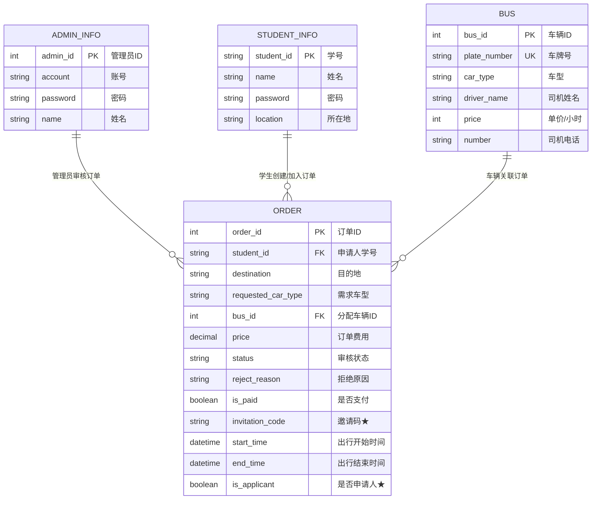
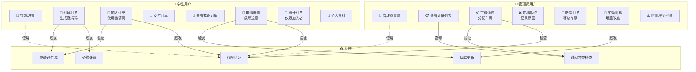
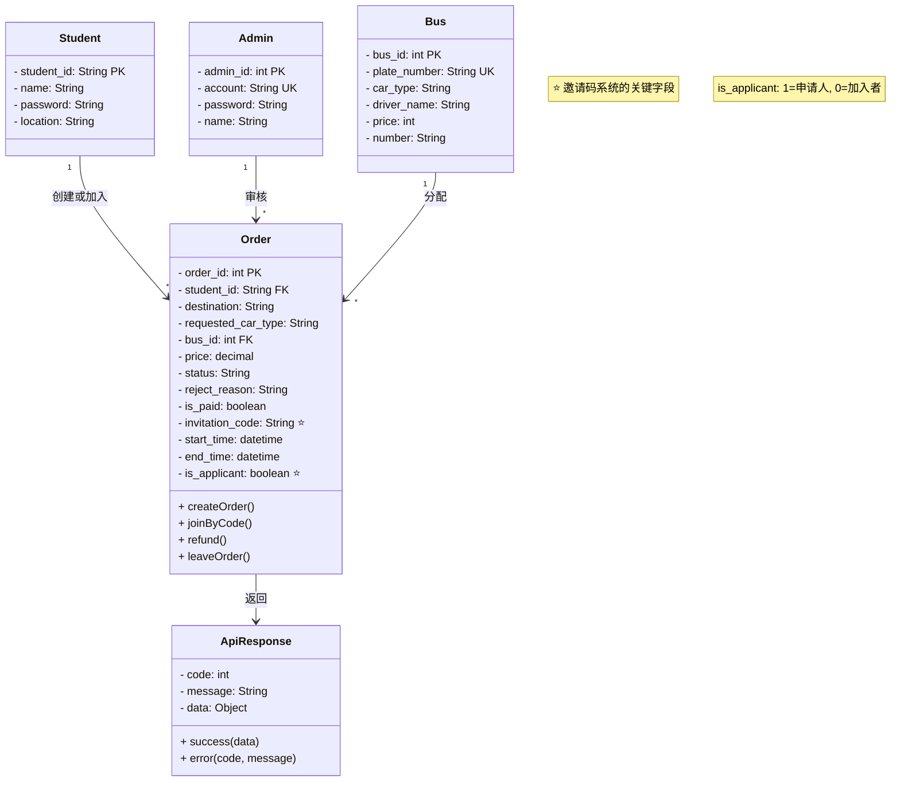
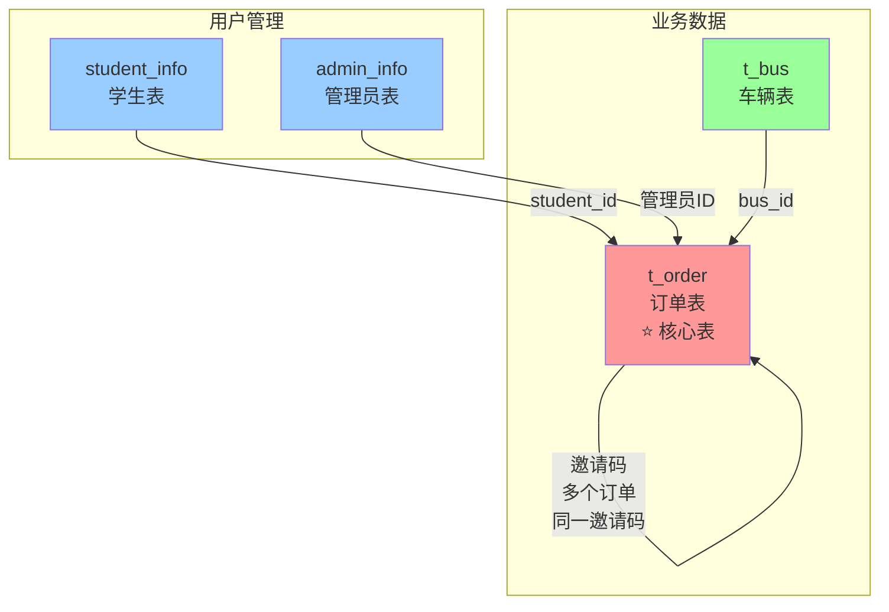
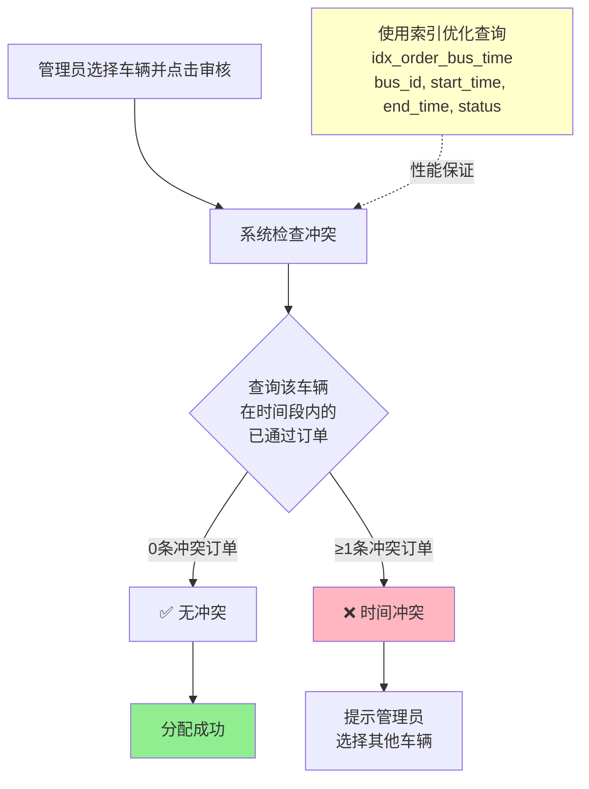

# 🚌 School Bus 系统帮助文档

> **文档版本**: v1.0 | **最后更新**: 2025-12-17
> **适用对象**: 学生用户、系统管理员、开发人员

**学生汽车包车预定系统** 是一个校园场景下的包车管理平台，支持学生在线申请包车，管理员审核和派车，实现包车业务的规范化、信息化管理。

---

## 📋 目录

1. [系统概述](#-系统概述)
2. [用户类型](#-用户类型)
3. [核心业务流程 (图表)](#-核心业务流程)
4. [学生端功能](#-学生端功能)
5. [管理员端功能](#-管理员端功能)
6. [数据库设计](#-数据库设计)
7. [API接口](#-api接口)
8. [常见问题 (FAQ)](#-常见问题)
9. [故障排查](#-故障排查)

---

## 🌟 系统概述

### 核心特性
- ✅ **在线申请**：随时随地提交包车需求
- ⚡ **快速审核**：管理员实时处理，派车高效
- 🤝 **拼车机制**：独创**邀请码**系统，支持多人加入同一订单
- 🔄 **级联退票**：申请人退票自动同步至同组所有成员
- 🛡️ **冲突检测**：智能防止车辆时间冲突

### 业务流向


---

## 👥 用户类型

### 1. 🧑‍🎓 学生用户
系统的主要使用者。
* **数据表**: `student_info`

| 字段 | 类型 | 说明 |
| :--- | :--- | :--- |
| `student_id` | **PK** | 学号 (登录账号) |
| `name` | String | 真实姓名 |
| `password` | String | 加密密码 |
| `location` | String | 常用所在地 |

### 2. 👮 管理员用户
系统的后台管理者。
* **数据表**: `admin_info`

| 字段 | 类型 | 说明 |
| :--- | :--- | :--- |
| `admin_id` | **PK** | 内部ID |
| `account` | String | 登录账号 (默认: admin) |
| `password` | String | 密码 (默认: 123456) |
| `name` | String | 管理员姓名 |

---

## 🔄 核心业务流程

### 场景 1：多人拼车与邀请码逻辑


### 场景 2：级联退票逻辑 (Refund Cascade)
> ⚠️ **警告**：退票操作具有破坏性，一旦执行，同组所有人的订单都将失效。


---

## 📐 系统 UML 图表

### 1. 实体关系图 (ER Diagram)



### 2. 系统用例图 (Use Case Diagram)



### 3. 订单状态流转图 (State Diagram)

```mermaid
stateDiagram-v2
    [*] --> 审核中

    审核中 --> 已通过: 管理员通过 + 分配车辆
    审核中 --> 已拒绝: 管理员拒绝<br/>或学生取消
    
    已通过 --> 已退票: 申请人申请退票<br/>级联更新所有同邀请码订单
    已通过 --> 已拒绝: 管理员撤销订单<br/>或车辆删除

    已拒绝 --> [*]
    已退票 --> [*]

    note right of 审核中
        • 学生可以取消订单
        • 仅限 is_applicant=1 的订单
    end

    note right of 已通过
        • 车辆已分配 bus_id != null
        • 申请人可申请退票
        • 加入者无法申请退票
    end

    note right of 已退票
        • 级联操作: 所有同邀请码
          订单都变为已退票
        • 终结性操作，不可逆转
    end

    note right of 已拒绝
        • 管理员拒绝 + 原因记录
        • 或因车辆删除自动拒绝
        • 或学生主动取消
    end
```

### 4. 类图 (Class Diagram) - 核心实体



### 5. 数据库表关系图



### 6. 时间冲突检查流程图



---

## 📱 学生端功能

### 1. 订单状态图例

| 状态标记 | 状态名称 | 含义 | 允许操作 |
| :---: | :--- | :--- | :--- |
| 🟡 | **审核中** | 订单已提交，等待管理员处理 | 取消订单 |
| 🟢 | **已通过** | 车辆已分配，准备出行 | 查看车辆、**申请退票** |
| 🔴 | **已拒绝** | 管理员驳回或系统自动取消 | 查看拒绝原因 |
| ⚫ | **已退票** | 申请人发起退票，流程终止 | 无 |

### 2. 关键功能指南

#### 🎟️ 通过邀请码加入
1.  获取他人分享的 **8位邀请码**。
2.  进入“加入包车”页面输入代码。
3.  **注意**：加入者与申请人共享同一辆车，且**无法再次查看邀请码**，也无权发起退票。

#### 💸 申请退票
* **前置条件**：
    * 必须是 **申请人** (`is_applicant=1`)
    * 订单状态为 **已通过**
* **后果**：该邀请码下的**所有学生**订单都会变为“已退票”。

---

## 💻 管理员端功能

### 1. 订单审核
* **通过 (Approve)**：
    * 系统会自动列出**无时间冲突**的可用车辆。
    * 若无车可用，请选择拒绝。
* **拒绝 (Reject)**：
    * 必须填写拒绝理由（如：“车辆不足”、“由于天气原因取消”）。

### 2. 车辆管理
删除车辆时，系统会执行**软处理**：
> 💡 **逻辑**：删除车辆 -> 系统自动查找该车辆所有“审核中/已通过”订单 -> 将状态改为“已拒绝” -> 理由自动填入“车辆已删除”。

---

## 💾 数据库设计

### 核心表：`t_order`
这是系统最关键的表，承载了拼车和状态流转逻辑。

```sql
CREATE TABLE `t_order` (
  `order_id` int(11) NOT NULL AUTO_INCREMENT,
  `student_id` varchar(20) NOT NULL COMMENT '申请人学号',
  `destination` varchar(255) NOT NULL COMMENT '目的地',
  `requested_car_type` varchar(255) NOT NULL COMMENT '需求车型',
  `bus_id` int(11) DEFAULT NULL COMMENT '分配车辆ID',
  `price` decimal(10,2) DEFAULT NULL COMMENT '订单费用',
  `status` varchar(20) DEFAULT '审核中' COMMENT '状态',
  `reject_reason` varchar(255) DEFAULT NULL COMMENT '拒绝理由',
  `invitation_code` varchar(20) DEFAULT NULL COMMENT '关键：邀请码',
  `start_time` datetime DEFAULT NULL,
  `end_time` datetime DEFAULT NULL,
  `is_applicant` tinyint(4) NOT NULL DEFAULT '1' COMMENT '1=发起人, 0=加入者',
  PRIMARY KEY (`order_id`),
  /* 联合唯一索引防止重复提交 */
  UNIQUE INDEX `idx_order_unique` (`student_id`, `invitation_code`, `bus_id`, `start_time`)
) ENGINE=InnoDB DEFAULT CHARSET=utf8mb4;
```

---

## 🔌 API接口

| 模块 | 方法 | 路径 | 描述 |
| :--- | :--- | :--- | :--- |
| **Auth** | `POST` | `/api/auth/student/login` | 学生登录 |
| **Order** | `POST` | `/api/student/order` | 创建新订单 (生成邀请码) |
| **Order** | `POST` | `/api/student/order/join` | **加入订单 (使用邀请码)** |
| **Order** | `POST` | `/api/student/order/refund/{id}` | **申请退票 (级联)** |
| **Admin** | `POST` | `/api/admin/order/approve` | 审核通过并派车 |

> 📖 完整文档请参阅项目根目录下的 `API_REQUIREMENTS.md`

---

## ❓ 常见问题

<details>
<summary><strong>Q1: 邀请码是什么？在哪看？</strong></summary>
<br>
邀请码是系统为每个新订单自动生成的 8 位随机字符（如 `ABC12345`）。
<br>
<strong>只有订单的“申请人”</strong>可以在“我的订单”详情中看到邀请码。加入者无法查看，这是为了防止邀请码被随意泄露。
</details>

<details>
<summary><strong>Q2: 为什么我不能申请退票？</strong></summary>
<br>
请检查以下两点：
<ol>
    <li>您是否是订单的<strong>加入者</strong>？只有发起订单的“申请人”才有权退票。</li>
    <li>订单状态是否为“已通过”？只有已通过的订单需要退票，审核中的订单直接取消即可。</li>
</ol>
</details>

<details>
<summary><strong>Q3: 退票后还能恢复吗？</strong></summary>
<br>
<strong>不能自助恢复。</strong> 退票操作是终结性的。如果误操作，请立即联系系统管理员，管理员需要在数据库后台或通过特殊接口手动干预。
</details>

---

## 🔧 故障排查

<details>
<summary><strong>🔴 问题：管理员派车时提示“时间冲突”</strong></summary>
<br>
<strong>原因</strong>：您试图分配的车辆，在当前订单的 <code>start_time</code> 和 <code>end_time</code> 范围内，已经存在另一个状态为“已通过”的订单。<br>
<strong>解决</strong>：请选择其他车辆，或者先撤销那个冲突的旧订单。
</details>

<details>
<summary><strong>🔴 问题：加入订单提示“邀请码无效”</strong></summary>
<br>
<strong>原因</strong>：
<ul>
    <li>邀请码输入错误（区分大小写）。</li>
    <li>原订单已被拒绝或已退票（邀请码随之失效）。</li>
    <li>您已经在这个订单里了（不能重复加入）。</li>
</ul>
</details>

---

> **获取更多帮助**
>
> * 📖 **API测试指南**: 见 `APIFOX_TEST_GUIDE.md`
> * 📝 **退票逻辑说明**: 见 `REFUND_IMPLEMENTATION_GUIDE.md`
> * 🛠️ **技术支持**: 请联系开发团队