# 🚌 School Bus 系统帮助文档

> **文档版本**: v1.0 | **最后更新**: 2025-12-17
> **适用对象**: 学生用户、系统管理员、开发人员

**学生汽车包车预定系统** 是一个校园场景下的包车管理平台，支持学生在线申请包车，管理员审核和派车，实现包车业务的规范化、信息化管理。

---

## 📋 目录

1. [系统概述](#-系统概述)
2. [用户类型](#-用户类型)
3. [核心业务流程 (图表)](#-核心业务流程)
4. [学生端功能](#-学生端功能)
5. [管理员端功能](#-管理员端功能)
6. [数据库设计](#-数据库设计)
7. [API接口](#-api接口)
8. [常见问题 (FAQ)](#-常见问题)
9. [故障排查](#-故障排查)

---

## 🌟 系统概述

### 核心特性
- ✅ **在线申请**：随时随地提交包车需求
- ⚡ **快速审核**：管理员实时处理，派车高效
- 🤝 **拼车机制**：独创**邀请码**系统，支持多人加入同一订单
- 🔄 **级联退票**：申请人退票自动同步至同组所有成员
- 🛡️ **冲突检测**：智能防止车辆时间冲突

### 业务流向

```mermaid
graph LR
    A[🧑‍🎓 学生申请] --> B[⏳ 管理员审核]
    B --> C{是否通过?}
    C -- 是 --> D[🚌 分配车辆]
    D --> E[✅ 订单确认]
    C -- 否 --> F[❌ 订单拒绝]
    E --> G[📊 管理与追踪]
```


---

## 👥 用户类型

### 1. 🧑‍🎓 学生用户
系统的主要使用者。
* **数据表**: `student_info`

| 字段 | 类型 | 说明 |
| :--- | :--- | :--- |
| `student_id` | **PK** | 学号 (登录账号) |
| `name` | String | 真实姓名 |
| `password` | String | 加密密码 |
| `location` | String | 常用所在地 |

### 2. 👮 管理员用户
系统的后台管理者。
* **数据表**: `admin_info`

| 字段 | 类型 | 说明 |
| :--- | :--- | :--- |
| `admin_id` | **PK** | 内部ID |
| `account` | String | 登录账号 (默认: admin) |
| `password` | String | 密码 (默认: 123456) |
| `name` | String | 管理员姓名 |

---

## 🔄 核心业务流程

### 场景 1：多人拼车与邀请码逻辑

```mermaid
sequenceDiagram
    participant A as 申请人 (Student A)
    participant S as 系统 (System)
    participant B as 加入者 (Student B)
    participant Admin as 管理员

    A->>S: 1. 创建订单
    S-->>A: 生成邀请码 (e.g., ABC12345)
    Note right of A: 仅申请人可见邀请码

    A->>B: 线下分享邀请码
    B->>S: 2. 输入邀请码加入
    S->>S: 验证有效性 & 复制订单信息
    S-->>B: 加入成功 (状态: 审核中)

    Admin->>S: 3. 审核通过 (分配车辆 Bus-01)
    S-->>A: 订单更新: 已通过 (Bus-01)
    S-->>B: 订单更新: 已通过 (Bus-01)
```


### 场景 2：级联退票逻辑 (Refund Cascade)
> ⚠️ **警告**：退票操作具有破坏性，一旦执行，同组所有人的订单都将失效。

```mermaid
graph TD
    A[申请人点击退票] --> B{检查权限}
    B -- is_applicant=1 --> C[执行级联更新]
    C --> D[查找同邀请码所有订单]
    D --> E[更新 申请人 订单 -> 已退票]
    D --> F[更新 加入者A 订单 -> 已退票]
    D --> G[更新 加入者B 订单 -> 已退票]
    B -- is_applicant=0 --> H[❌ 拒绝操作]
```



---

## 📐 系统 UML 图表

### 1. 实体关系图 (ER Diagram)

```
┌─────────────────┐
│  student_info   │
├─────────────────┤
│ student_id (PK) │◄──────┐
│ name            │       │
│ password        │       │
│ location        │       │
└─────────────────┘       │
                          │
                    ┌─────┴──────────┐
                    │                │
┌─────────────┐    ┌─────────────┐  │
│ admin_info  │    │  t_order    │  │ 1对多
├─────────────┤    ├─────────────┤  │
│ admin_id(PK)├───►│ order_id(PK)│◄─┘
│ account(UK) │    │ student_id  │
│ password    │    │ bus_id      │
│ name        │    │ status      │
└─────────────┘    │ price       │
                   │ invitation_ │
                   │ code ⭐     │
                   │ is_applicant│⭐
                   │ start_time  │
                   │ end_time    │
                   └─────▲───────┘
                         │
                         │ 1对多
                   ┌─────┴────────┐
                   │              │
              ┌────────────────┐  │
              │    t_bus       │  │
              ├────────────────┤  │
              │ bus_id (PK)    ├──┘
              │ plate_number   │
              │ car_type       │
              │ driver_name    │
              │ price/hour     │
              │ number         │
              └────────────────┘
```

### 2. 系统用例图 (Use Case Diagram)

```
                      ┌──────────────────────────────────────┐
                      │         🧑‍🎓 学生用户                   │
                      ├──────────────────────────────────────┤
                      │ • 🔐 登录/注册                         │
                      │ • 📝 创建订单 (生成邀请码)             │
                      │ • 🤝 加入订单 (使用邀请码)             │
                      │ • 💸 支付订单                          │
                      │ • 📱 查看我的订单                      │
                      │ • 🔄 申请退票 (级联)                   │
                      │ • 🚪 离开订单 (仅加入者)               │
                      │ • 👤 个人资料                          │
                      └──────────────────────────────────────┘

                      ┌──────────────────────────────────────┐
                      │       👮 管理员用户                    │
                      ├──────────────────────────────────────┤
                      │ • 🔐 管理员登录                        │
                      │ • 📋 查看订单列表                      │
                      │ • ✅ 审核通过 (分配车辆)               │
                      │ • ❌ 审核拒绝 (记录原因)                │
                      │ • 🔄 撤销订单 (释放车辆)                │
                      │ • 🚌 车辆管理 (增删改查)                │
                      │ • ⚠️  时间冲突检查                     │
                      └──────────────────────────────────────┘

                      ┌──────────────────────────────────────┐
                      │        ⚙️ 系统核心功能                │
                      ├──────────────────────────────────────┤
                      │ • 邀请码生成 (8位随机码)              │
                      │ • 时间冲突检查 (智能派车)              │
                      │ • 级联更新 (批量操作)                  │
                      │ • 权限验证 (角色检查)                  │
                      │ • 价格计算 (时间×单价)                 │
                      └──────────────────────────────────────┘
```

### 3. 订单状态流转图 (State Diagram)

```mermaid
graph TD
    Start([开始])
    Start --> A["🟡 审核中"]
    
    A -->|管理员通过 + 分配车辆| B["🟢 已通过"]
    A -->|管理员拒绝 或 学生取消| C["🔴 已拒绝"]
    
    B -->|申请人申请退票 级联更新| D["⚫ 已退票"]
    B -->|管理员撤销 或 车辆删除| C
    
    C --> End([结束])
    D --> End
    
    A -.描述.-> N1["学生可以取消订单<br/>仅限 is_applicant=1"]
    B -.描述.-> N2["车辆已分配 bus_id != null<br/>申请人可申请退票<br/>加入者无法申请退票"]
    D -.描述.-> N3["级联操作: 同邀请码所有订单变为已退票<br/>终结性操作，不可逆转"]
    C -.描述.-> N4["管理员拒绝 + 原因记录<br/>或因车辆删除自动拒绝<br/>或学生主动取消"]
    
    style A fill:#FFE082,stroke:#FBC02D,color:#000
    style B fill:#81C784,stroke:#558B2F,color:#fff
    style C fill:#E57373,stroke:#C62828,color:#fff
    style D fill:#424242,stroke:#000,color:#fff
```



### 4. 核心实体类关系 (Class Relationship)

```
┌──────────────────────────┐
│      Student (学生)       │
├──────────────────────────┤
│ - student_id: String PK  │
│ - name: String           │
│ - password: String       │
│ - location: String       │
└────────┬─────────────────┘
         │ 1对多
         │ 创建/加入
         │
    ┌────▼──────────────────────────────┐
    │       Order (订单) ⭐              │
    ├────────────────────────────────────┤
    │ - order_id: int PK                │
    │ - student_id: String FK           │
    │ - destination: String             │
    │ - requested_car_type: String      │
    │ - bus_id: int FK                  │
    │ - price: decimal                  │
    │ - status: String                  │
    │ - invitation_code: String ⭐      │
    │ - start_time: datetime            │
    │ - end_time: datetime              │
    │ - is_applicant: boolean ⭐        │
    │                                   │
    │ + createOrder()                   │
    │ + joinByCode()                    │
    │ + refund()                        │
    │ + leaveOrder()                    │
    └─┬────────────────────────────┬────┘
      │ 1对多 (分配车辆)           │ 多对1 (管理员审核)
      │                            │
    ┌─▼────────────────────┐  ┌────▼──────────────────┐
    │   Bus (车辆)          │  │   Admin (管理员)      │
    ├─────────────────────┤  ├─────────────────────┤
    │ - bus_id: int PK    │  │ - admin_id: int PK │
    │ - plate_number: Str │  │ - account: String  │
    │ - car_type: String  │  │ - password: String │
    │ - driver_name: Str  │  │ - name: String     │
    │ - price: int        │  └────────────────────┘
    │ - number: String    │
    └─────────────────────┘

API 返回格式统一：
┌─────────────────────────────┐
│    ApiResponse<T>           │
├─────────────────────────────┤
│ - code: int (200/400/401...) │
│ - message: String           │
│ - data: T (泛型数据)         │
│                             │
│ + success(data)             │
│ + error(code, message)      │
└─────────────────────────────┘
```

### 5. 数据库表关系

```
用户管理                           业务数据
┌─────────────────┐               ┌──────────────┐
│ student_info    │               │  t_order     │◄─── ⭐ 核心表
│ 学生表          │◄──┐           │  订单表       │
└─────────────────┘   │           │              │
                      ├──→ 外键 ──→├──────────────┤
┌─────────────────┐   │           │ 关键字段:     │
│ admin_info      │◄──┘           │ • invitation_│
│ 管理员表        │               │   code (邀请码)
└─────────────────┘               │ • is_applic- │
                                  │   ant (身份)  │
                                  └──────────────┘
                                        ▲
                                        │ 1对多
                                        │ (同邀请码)
                                        │
                      ┌──────────────┐
                      │  t_bus       │
                      │  车辆表      │
                      └──────────────┘

重要索引：
• idx_order_bus_time (bus_id, start_time, end_time, status)
  └─ 用于: 时间冲突检查
  
• idx_invitation_code_status (invitation_code, status)
  └─ 用于: 邀请码查询、级联更新
```

### 6. 时间冲突检查流程

```
┌────────────────────────────────────────┐
│ 管理员选择车辆并点击【审核通过】        │
└──────────────┬─────────────────────────┘
               │
               ▼
┌────────────────────────────────────────┐
│ 系统查询该车辆在指定时间段内的订单      │
│ SQL: SELECT COUNT(*) FROM t_order      │
│ WHERE bus_id = ? AND status = '已通过'  │
│   AND start_time < ? AND end_time > ?  │
└──────────────┬─────────────────────────┘
               │
        ┌──────┴──────┐
        │             │
        ▼             ▼
   ┌─────────┐   ┌───────────┐
   │ 0条冲突 │   │ ≥1条冲突  │
   └────┬────┘   └─────┬─────┘
        │              │
        ▼              ▼
   ┌─────────┐   ┌──────────────┐
   │ ✅无冲突 │   │ ❌ 时间冲突   │
   │分配成功  │   │提示管理员选择 │
   └─────────┘   │其他车辆      │
                 └──────────────┘

性能优化:
• 使用复合索引 idx_order_bus_time
• 快速定位冲突订单
• 避免全表扫描
```

---

## 📱 学生端功能

### 1. 订单状态图例

| 状态标记 | 状态名称 | 含义 | 允许操作 |
| :---: | :--- | :--- | :--- |
| 🟡 | **审核中** | 订单已提交，等待管理员处理 | 取消订单 |
| 🟢 | **已通过** | 车辆已分配，准备出行 | 查看车辆、**申请退票** |
| 🔴 | **已拒绝** | 管理员驳回或系统自动取消 | 查看拒绝原因 |
| ⚫ | **已退票** | 申请人发起退票，流程终止 | 无 |

### 2. 关键功能指南

#### 🎟️ 通过邀请码加入
1.  获取他人分享的 **8位邀请码**。
2.  进入“加入包车”页面输入代码。
3.  **注意**：加入者与申请人共享同一辆车，且**无法再次查看邀请码**，也无权发起退票。

#### 💸 申请退票
* **前置条件**：
    * 必须是 **申请人** (`is_applicant=1`)
    * 订单状态为 **已通过**
* **后果**：该邀请码下的**所有学生**订单都会变为“已退票”。

---

## 💻 管理员端功能

### 1. 订单审核
* **通过 (Approve)**：
    * 系统会自动列出**无时间冲突**的可用车辆。
    * 若无车可用，请选择拒绝。
* **拒绝 (Reject)**：
    * 必须填写拒绝理由（如：“车辆不足”、“由于天气原因取消”）。

### 2. 车辆管理
删除车辆时，系统会执行**软处理**：
> 💡 **逻辑**：删除车辆 -> 系统自动查找该车辆所有“审核中/已通过”订单 -> 将状态改为“已拒绝” -> 理由自动填入“车辆已删除”。

---

## 💾 数据库设计

### 核心表：`t_order`
这是系统最关键的表，承载了拼车和状态流转逻辑。

```sql
CREATE TABLE `t_order` (
  `order_id` int(11) NOT NULL AUTO_INCREMENT,
  `student_id` varchar(20) NOT NULL COMMENT '申请人学号',
  `destination` varchar(255) NOT NULL COMMENT '目的地',
  `requested_car_type` varchar(255) NOT NULL COMMENT '需求车型',
  `bus_id` int(11) DEFAULT NULL COMMENT '分配车辆ID',
  `price` decimal(10,2) DEFAULT NULL COMMENT '订单费用',
  `status` varchar(20) DEFAULT '审核中' COMMENT '状态',
  `reject_reason` varchar(255) DEFAULT NULL COMMENT '拒绝理由',
  `invitation_code` varchar(20) DEFAULT NULL COMMENT '关键：邀请码',
  `start_time` datetime DEFAULT NULL,
  `end_time` datetime DEFAULT NULL,
  `is_applicant` tinyint(4) NOT NULL DEFAULT '1' COMMENT '1=发起人, 0=加入者',
  PRIMARY KEY (`order_id`),
  /* 联合唯一索引防止重复提交 */
  UNIQUE INDEX `idx_order_unique` (`student_id`, `invitation_code`, `bus_id`, `start_time`)
) ENGINE=InnoDB DEFAULT CHARSET=utf8mb4;
```

---

## 🔌 API接口

| 模块 | 方法 | 路径 | 描述 |
| :--- | :--- | :--- | :--- |
| **Auth** | `POST` | `/api/auth/student/login` | 学生登录 |
| **Order** | `POST` | `/api/student/order` | 创建新订单 (生成邀请码) |
| **Order** | `POST` | `/api/student/order/join` | **加入订单 (使用邀请码)** |
| **Order** | `POST` | `/api/student/order/refund/{id}` | **申请退票 (级联)** |
| **Admin** | `POST` | `/api/admin/order/approve` | 审核通过并派车 |

> 📖 完整文档请参阅项目根目录下的 `API_REQUIREMENTS.md`

---

## ❓ 常见问题

<details>
<summary><strong>Q1: 邀请码是什么？在哪看？</strong></summary>
<br>
邀请码是系统为每个新订单自动生成的 8 位随机字符（如 `ABC12345`）。
<br>
<strong>只有订单的“申请人”</strong>可以在“我的订单”详情中看到邀请码。加入者无法查看，这是为了防止邀请码被随意泄露。
</details>

<details>
<summary><strong>Q2: 为什么我不能申请退票？</strong></summary>
<br>
请检查以下两点：
<ol>
    <li>您是否是订单的<strong>加入者</strong>？只有发起订单的“申请人”才有权退票。</li>
    <li>订单状态是否为“已通过”？只有已通过的订单需要退票，审核中的订单直接取消即可。</li>
</ol>
</details>

<details>
<summary><strong>Q3: 退票后还能恢复吗？</strong></summary>
<br>
<strong>不能自助恢复。</strong> 退票操作是终结性的。如果误操作，请立即联系系统管理员，管理员需要在数据库后台或通过特殊接口手动干预。
</details>

---

## 🔧 故障排查

<details>
<summary><strong>🔴 问题：管理员派车时提示“时间冲突”</strong></summary>
<br>
<strong>原因</strong>：您试图分配的车辆，在当前订单的 <code>start_time</code> 和 <code>end_time</code> 范围内，已经存在另一个状态为“已通过”的订单。<br>
<strong>解决</strong>：请选择其他车辆，或者先撤销那个冲突的旧订单。
</details>

<details>
<summary><strong>🔴 问题：加入订单提示“邀请码无效”</strong></summary>
<br>
<strong>原因</strong>：
<ul>
    <li>邀请码输入错误（区分大小写）。</li>
    <li>原订单已被拒绝或已退票（邀请码随之失效）。</li>
    <li>您已经在这个订单里了（不能重复加入）。</li>
</ul>
</details>

---

> **获取更多帮助**
>
> * 📖 **API测试指南**: 见 `APIFOX_TEST_GUIDE.md`
> * 📝 **退票逻辑说明**: 见 `REFUND_IMPLEMENTATION_GUIDE.md`
> * 🛠️ **技术支持**: 请联系开发团队